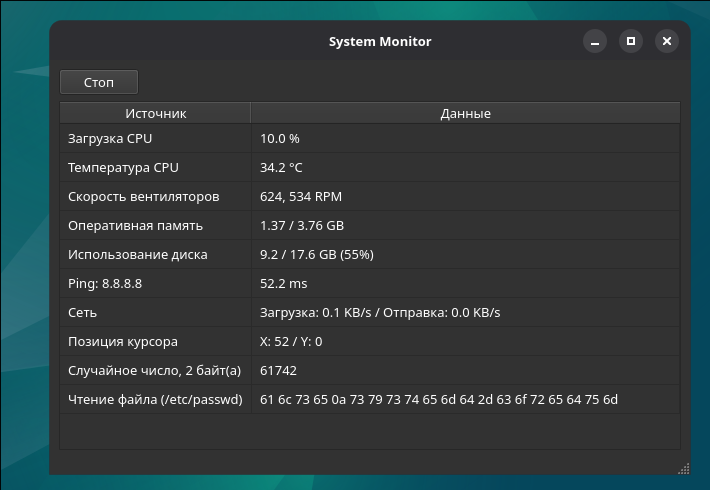
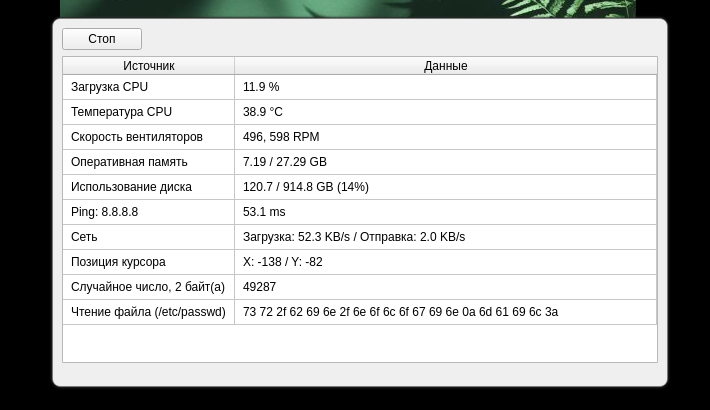

# Системный монитор
Графическое приложение для мониторинга системных параметров в реальном времени.
<br><br>

<br><br>


## Обзор
Приложение отображает данные из 10 независимых источников. Каждый источник работает в отдельном потоке, обновляя интерфейс без блокировки. Проект построен на принципах DDD и чистой архитектуры.

### Стек
- **Python 3.13**
- **PySide6** — графический интерфейс
- **psutil** — системные данные

## Архитектура
Проект разделён на четыре слоя. Зависимости направлены внутрь — от внешних слоёв к ядру.

### Domain (ядро)
- `DataSample` — объект-значение, представляющий измерение
- `DataSource` — абстрактный интерфейс для источников данных

### Infrastructure
- 10 источников данных (CPU, память, диск, сеть, температура, вентиляторы, пинг, курсор, бинарный файл, случайные числа)
- Конфигурация и логирование

### Application
- `MonitorService` — управление потоками
- `DataFetcher` — периодический опрос источника в фоновом потоке

### Presentation
- `MainWindow` — кнопка, таблица, статус-бар, копирование `Ctrl+C`

## Возможности
- 10 независимых потоков
- Безопасное обновление GUI через сигналы/слоты PySide6
- Декоратор `catch_errors` — перехват ошибок для последующей отправки в GUI
- Копирование выделенной ячейки в буфер обмена через `Ctrl+C`
- Настраиваемые интервалы обновления для каждого источника
- Запись логов в файл и в консоль
- Настройка через файл конфигурации src/infrastructure/config.py

## Требования
- ОC: Linux
- Python **3.13** или выше
- Менеджер пакетов `uv` (рекомендуется)

## Установка и запуск
```bash
cd system-monitor

# Создайте виртуальное окружение и установите зависимости
uv sync

# Запустите приложение
uv run main.py
```

### Настройка
Редактируйте файл src/infrastructure/config.py (ниже только часть настроек):
```python
# Путь к лог-файлу
DEFAULT_LOG_PATH: Path = Path("monitor.log")

# Интервалы обновления
DEFAULT_UPDATE_INTERVAL_SECONDS = 2.0
CUSTOM_UPDATE_INTERVALS_SECONDS = {
    "MouseCursorPositionSource": 0.1,  # быстрее для курсора
}

# Настройки источников
PING_HOST = "8.8.8.8"
BINARY_DATA_PATH = Path("/путь/к/вашему/файлу.bin")
```

## Контакты

По всем вопросам:
- 🌐 [https://vk.ru/vectrax](https://vk.ru/vectrax)
- 💬 [https://t.me/vectravox](https://t.me/vectravox)
- ✉️ [vectravox@gmail.com](vectravox@gmail.com)
